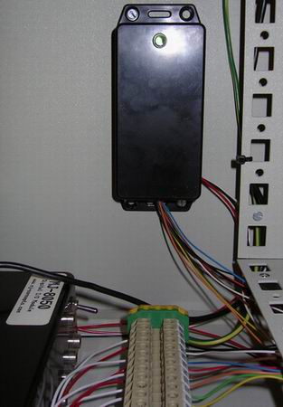

## Source code for project: [Rack box mute and light controller](https://link.stdout.no/e)

This module takes care of misc small tasks in the [Rack box project](https://link.stdout.no/C), uses an AVR ATtiny2313 microcontroller.

Written in basic, using [Bascom-AVR](http://www.mcselec.com/).

### Author
[Thomas Jensen](https://thomas.stdout.no)
